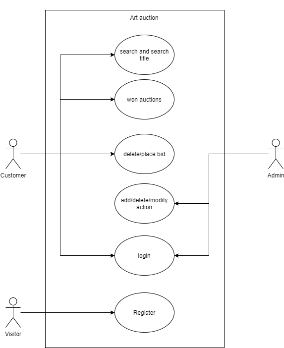
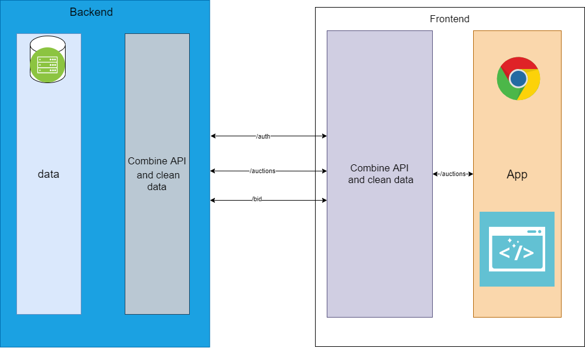
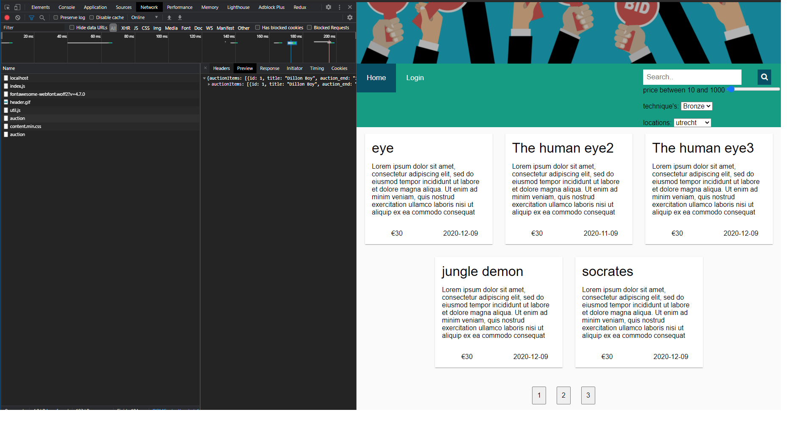

# Assigment 2: Frontend auction
- 09-10-2020
- Nathan Ganesh  - 489290
- Saxion deventer
- DHI2S0 

## Table of Contents
1. [Introduction](#Introduction)
2. [Front-end and backend communication](#communicationbackend)
3. [login](#login)

## introduction
The goal of the assigment is to have a fully functional website. For this assigment we have to build a front-end for the back-end that was created in assigment 1. The goal is that users can interact with a front-end setup for the website in the requirements. The users will be primarily new visitors, bidders and the admin. 

##front end and backend communication
The way the backend and frontend works is by communicating to each other. When a certain url gets accessed the server will first respond with the html file for the corresponding path. After that the static files like index.js and css will get requested and send over. For each page there is a separate javascript file. On each page there will be separate request happening. For example on the home auction page there will be a request GET request send from the index.js to the backend. Once the results are coming back from the backend other functions inside the index.js will be setting up the layout for the page.

##login
The login information for the provided users are:

| username   |      password      |  role |
|----------|:-------------:|------:|
|henk| Henk!23 | admin |
|user|   admin   |   user |
|henk3| Henk!23 |    user |

## github
https://github.com/NathanGanesh/therealdealwebtech/tree/dog

